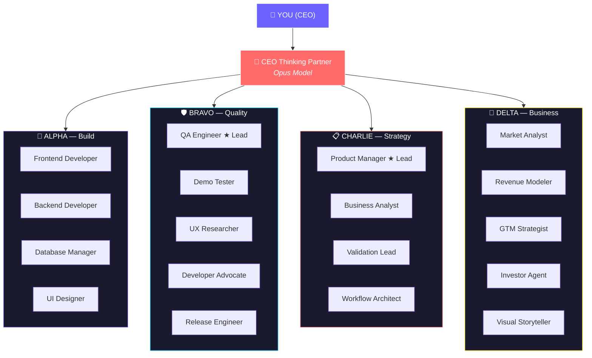

<div align="center">

<a href="https://github.com/The13thNode/VibeCorp_PromptCEO">
  
</a>

<br/>

<a href="https://github.com/The13thNode/VibeCorp_PromptCEO">
  
</a>

<br/>


</div>

---

# PromptCEO by VibeCorp

**Turn a business idea into a product with 26 AI agents working as your team.**

PromptCEO is a free, open-source framework that gives you a complete AI-powered product team. One CEO agent coordinates 25 specialist agents — organized into four teams (Build, Quality, Strategy, Business) plus floating specialists — all working together to think, build, test, and ship your product.

This isn't theory. Every pattern in this framework was battle-tested across 50+ sessions, 17 versions, and 100+ commits on a real product ([NestMatch UAE](https://github.com/HotspotVPN/Nest_Match_UAE) — a verified shared-accommodation platform for the UAE market) — then extracted into this universal framework so anyone can use it.

> **New here?** Start with the [Step-by-Step Guide](docs/STEP_BY_STEP_GUIDE.md) or read the [Beginner's Guide](docs/BEGINNERS_GUIDE.md) if you're unfamiliar with Claude Code, GitHub, or AI agents. Have questions? Read the [FAQ](docs/FAQ.md).

---

## About the Creator

**The13thNode** · *NeuralEntropy_VPN*

AI geek in a state of permanent hyperfocus. Architecting the 13th Floor — building the agentic C-Suite with a swarm of AI agents that scale through automation.

PromptCEO was born from building [NestMatch UAE](https://github.com/HotspotVPN/Nest_Match_UAE), a DLD/RERA-compliant shared-accommodation platform for the UAE rental market. Rather than hiring a traditional team, the entire product — frontend, backend, QA, market analysis, investor pitch — was built by AI agents orchestrated through Claude Code. The patterns that worked were extracted. The patterns that failed were discarded. What remained became PromptCEO.

VibeCorp is the umbrella for two open-source projects: **PromptCEO** (agents for building) and **[CoworkSkills](https://github.com/The13thNode/VibeCorp_CoworkSkills)** (skills for thinking).

---

## What You'll Get



**Floating Specialists** (cross-team, activated on demand):
Security Auditor · Build Quality Auditor · Code Reviewer · Safety Guard · Developer Provocateur · Provocateur · Social Host

---

## Before & After

| Without PromptCEO | With PromptCEO |
|---|---|
| You're one person with a business idea | You have a 26-agent product team |
| You context-switch between strategy, code, testing, and business | Each agent specializes in their domain |
| Knowledge is lost between sessions | Execution memory persists across sessions |
| No governance — anything goes | Three-tier approval system with CEO oversight |
| You forget what you decided and why | Full traceability matrix and decision log |
| Working alone with no second opinion | CEO thinking partner challenges your assumptions |

---

## Prerequisites

1. **A Claude subscription** — [Claude Pro](https://claude.ai/upgrade) ($20/month) or Claude Max ($100-200/month) for heavier usage
2. **A computer** — Windows, Mac, or Linux
3. **A GitHub account** — [Sign up free](https://github.com/join)
4. **A business idea** — The thing you want to build

That's it. You don't need to know how to code.

---

## Quick Start

```bash
# 1. Clone the framework
git clone https://github.com/The13thNode/VibeCorp_PromptCEO.git
cd VibeCorp_PromptCEO

# 2. Fill in your project details
# Open CLAUDE.md and replace all [PLACEHOLDER] values with your project info

# 3. Start your CEO agent
claude "Read CLAUDE.md and begin session start ritual"
```

For a detailed walkthrough, see the [Full Guide](docs/FULL_GUIDE.md). For experienced developers, see the [Quick Start](docs/QUICK_START.md).

---

## How It Works

PromptCEO is built on three pillars: **agents** (who does the work), **protocols** (how they coordinate), and **skills** (what they know how to do).

**Agents** — 26 markdown files in `.claude/agents/` that give Claude a specific role, expertise, and behavioral rules. The CEO orchestrator (defined in `CLAUDE.md`) routes tasks to the right specialist.

**Protocols** — Seven governance rules that keep agents coordinated and safe:

| Protocol | Purpose |
|---|---|
| [Chain of Command](protocols/CHAIN_OF_COMMAND.md) | Who reports to whom, escalation paths |
| [Approval Gates](protocols/APPROVAL_GATES.md) | Three tiers: auto-execute, post-check, CEO approval |
| [Message Bus](protocols/MESSAGE_BUS.md) | How agents communicate with each other |
| [Execution Memory](protocols/EXECUTION_MEMORY.md) | How knowledge persists across sessions |
| [Token Budget](protocols/TOKEN_BUDGET_PROTOCOL.md) | Cost control and model selection rules |
| [Ownership & Jira](protocols/OWNERSHIP_AND_JIRA.md) | System ownership tracking and ticket management |
| [Agent Activation](protocols/AGENT_ACTIVATION_CHECKLIST.md) | Pre-flight checklist before spawning agents |

**Skills** — 58 reusable modules in `skills/` that agents load just-in-time (e.g., security-audit, design-system, market-analysis). Not loaded upfront — only when needed.

---

## The 26 Agents

### Team Alpha — Product Build

| # | Agent | Role |
|---|---|---|
| 1 | Frontend Developer | UI components, design system implementation |
| 2 | Backend Developer | APIs, database, server logic |
| 3 | Database Manager | Schema design, migrations, optimization |
| 4 | UI Designer | Design system, 3-option proposals, component review |

### Team Bravo — Quality Gate

| # | Agent | Role |
|---|---|---|
| 5 | QA Engineer (Team Lead) | Testing, bug tracking, quality gates |
| 6 | Demo Tester | Investor demo readiness, DEMO-BLOCKER findings |
| 7 | UX Researcher | User journey testing, Journey Test Records |
| 8 | Developer Advocate | First-time user DX audit |
| 9 | Release Engineer | Release pipeline (Tier 3 — founder trigger only) |

### Team Charlie — Strategy

| # | Agent | Role |
|---|---|---|
| 10 | Product Manager (Team Lead) | PRDs, roadmap, feature prioritization |
| 11 | Business Analyst | Requirements, user stories, acceptance criteria |
| 12 | Validation Lead | Hypothesis testing, evidence gathering |
| 13 | Workflow Architect | State machines, flow design, pre-engineering review |

### Team Delta — Business

| # | Agent | Role |
|---|---|---|
| 14 | Market Analyst | Market research, competitor analysis |
| 15 | Revenue Modeler | Financial projections, pricing strategy |
| 16 | GTM Strategist | Go-to-market planning, launch strategy |
| 17 | Investor Agent | Pitch deck, fundraising strategy |
| 18 | Visual Storyteller | Demo narration, pitch content |

### Floating Specialists

| # | Agent | Role |
|---|---|---|
| 19 | CEO Thinking Partner | Strategic advisor, 7 thinking modes (Opus model) |
| 20 | Security Auditor | Vulnerability assessment, compliance (VETO holder) |
| 21 | Build Quality Auditor | Post-sprint code audit, SEV-1-5 (VETO holder) |
| 22 | Developer Provocateur | In-sprint READ-ONLY code challenger |
| 23 | Code Reviewer | 4-stage review pipeline |
| 24 | Safety Guard | Destructive command guard (VETO holder) |
| 25 | Social Host | Optional team social sessions |
| 26 | Provocateur | Post-sprint external audit, rotating lens |

---

## Model Policy

| Model | Role | Cost (per 1M tokens) |
|---|---|---|
| **Opus** | CEO Thinking Partner only | $15 input / $75 output |
| **Sonnet** | All 25 sub-agents | $3 input / $15 output |
| **Haiku** | Trivial tasks only | $0.25 input / $1.25 output |

Token Budget zones: GREEN (0-60%) normal · YELLOW (60-80%) compact · RED (80-95%) stop · BLACK (95%+) emergency halt.

---

## Integrations

| Tool | Purpose | Cost | Setup Guide |
|---|---|---|---|
| **Discord** | Agent notifications (12 channels) | **Free** | [Discord Setup](docs/DISCORD_SETUP.md) |
| Slack | Agent notifications (alternative) | Paid (~$8.75/user/mo) | [Slack Setup](docs/SLACK_SETUP.md) |
| Jira | Ticket management and sprint tracking | Free tier available | [Jira Setup](docs/JIRA_SETUP.md) |
| Notion | Command center and knowledge base | Free tier available | [Notion Setup](docs/NOTION_SETUP.md) |
| Telegram | Remote access to Claude Code | Free | [Telegram Setup](docs/TELEGRAM_SETUP.md) |

All integrations are optional. Discord is recommended as the default (free) notification layer.

---

## Project Structure

```
VibeCorp_PromptCEO/
├── README.md                ← You are here
├── CLAUDE.md                ← Template: fill in for your project
├── SETUP.md                 ← Step-by-step deployment guide
├── SECURITY.md              ← Data boundaries and guardrails
├── CONTRIBUTING.md          ← How to contribute
├── LICENSE                  ← MIT (use it however you want)
│
├── .claude/agents/          ← 26 agent definition files
├── protocols/               ← 7 governance protocols
├── skills/                  ← 58 reusable agent skills
├── scripts/                 ← Discord/Slack notification + deployment scripts
├── templates/               ← Fill-in templates for your project
├── docs/                    ← Full documentation (16 guides)
└── examples/                ← Real-world and blank-SaaS examples
```

---

## Documentation

| Document | For | Description |
|---|---|---|
| [Step-by-Step Guide](docs/STEP_BY_STEP_GUIDE.md) | Complete Beginners | Zero-to-running, every click explained |
| [Beginner's Guide](docs/BEGINNERS_GUIDE.md) | Complete Beginners | What is Claude Code, GitHub, agents, MCP, tokens |
| [Quick Start](docs/QUICK_START.md) | Developers | 5-minute setup |
| [Full Guide](docs/FULL_GUIDE.md) | Everyone | Complete walkthrough from zero |
| [Architecture](docs/ARCHITECTURE.md) | Technical | How the system works |
| [Model Policy](docs/MODEL_POLICY.md) | Everyone | When to use which Claude model |
| [Agent Teams](docs/AGENT_TEAMS.md) | Advanced | Experimental parallel agents |
| [Deployment Guide](docs/DEPLOYMENT_GUIDE.md) | Technical | Production deployment patterns |
| [Security](SECURITY.md) | Everyone | Data boundaries and guardrails |
| [Discord Setup](docs/DISCORD_SETUP.md) | Everyone | Free notification setup (12 channels) |
| [Obsidian Setup](docs/OBSIDIAN_SETUP.md) | Everyone | Free local knowledge base |
| [Choose Your Stack](docs/TOOL_COMPARISON.md) | Everyone | Pick your tools (free and paid options) |
| [FAQ](docs/FAQ.md) | Everyone | Common questions answered |

---

## Examples

- **[Marketplace Example](examples/marketplace/)** — Two-sided marketplace with supply/demand validation, compliance tiers, and marketplace-specific agent rules.
- **[Blank SaaS](examples/blank-saas/)** — Starting template for a SaaS product with common defaults pre-filled.

---

## PromptCEO vs CoworkSkills

| | PromptCEO | CoworkSkills |
|---|---|---|
| **What it is** | Agent framework for Claude Code | Chat skills for Claude.ai / Cowork |
| **How it works** | Agents read/write files, run commands, build software | Copy a skill into a Claude Project, chat with it |
| **Requires** | Terminal, Claude Code CLI | Browser only — no terminal needed |
| **Best for** | Building products, writing code, managing sprints | Strategy, planning, analysis, business thinking |
| **Agents** | 26 specialized agents with governance | No agents — skill-guided conversations |

**Use CoworkSkills for thinking. Use PromptCEO for building.**

Sister repo: [VibeCorp CoworkSkills](https://github.com/The13thNode/VibeCorp_CoworkSkills)

---

## Origin Story

PromptCEO wasn't designed in a vacuum. It was extracted from building a real product.

[NestMatch UAE](https://github.com/HotspotVPN/Nest_Match_UAE) is a verified shared-accommodation platform for the UAE rental market — DLD/RERA compliant, with identity verification tiers, occupancy governance, and transport-proximity matching. The entire product was built by a single developer orchestrating AI agents through Claude Code.

Over 50+ sessions, patterns emerged: which agent configurations worked, how to prevent destructive actions, when to use Opus vs Sonnet, how to persist knowledge across sessions, and how to keep agents coordinated without chaos. Version after version, the framework was refined — until it was mature enough to extract into a standalone, product-agnostic framework.

That extraction became PromptCEO. The NestMatch-specific rules were stripped. The universal patterns were kept. What you're looking at is the result.

---

## Glossary

| Term | Definition |
|---|---|
| **Agent** | A markdown file in `.claude/agents/` that gives Claude a specific role and behavioral rules |
| **CEO Orchestrator** | The top-level agent (in `CLAUDE.md`) that routes tasks to specialists |
| **Skill** | A reusable capability module in `skills/` loaded by agents just-in-time |
| **Protocol** | A governance rule in `protocols/` controlling agent coordination |
| **Execution Memory** | System for persisting decisions and context across sessions |
| **Token Budget** | Cost-control system with zones: GREEN → YELLOW → RED → BLACK |
| **Approval Tier** | Tier 1 (auto-execute), Tier 2 (post-check), Tier 3 (CEO approval required) |
| **VETO Holder** | Agents that can block actions: Security Auditor, Build Quality Auditor, Safety Guard |
| **MCP** | Model Context Protocol — lets Claude Code connect to external tools |
| **JIT** | Just-In-Time — loading skills only when needed to save tokens |
| **Opus / Sonnet / Haiku** | Claude model tiers: Opus (most capable), Sonnet (balanced), Haiku (fastest) |

---

## Disclaimer

This is a community project. **It is not affiliated with, endorsed by, or sponsored by Anthropic.**

PromptCEO is a framework — a set of files and patterns. It does not guarantee any particular outcome. AI agents can and will make mistakes. Always review their output, especially for legal and compliance matters, financial calculations, security-critical code, and anything that affects real users or real money.

The framework was built with one real product. Your results will vary based on your idea, your input, and how you use the tools.

---

## License

MIT — use it however you want. See [LICENSE](LICENSE).

---

## Credits

Built by [VibeCorp](https://github.com/The13thNode). Battle-tested on a real product, then extracted into this universal framework.

See [CREDITS.md](docs/CREDITS.md) for full attribution to all open-source projects and contributors that made this possible.

---

<div align="center">

`ai-agents` `claude-code` `prompt-engineering` `multi-agent-systems` `agent-orchestration` `open-source` `developer-tools` `startup-tools` `saas-framework` `ai-governance` `mcp-servers` `vibecorp`

</div>
